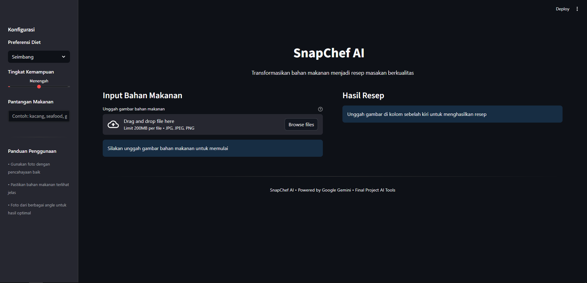

# SnapChef AI

**SnapChef AI** adalah aplikasi asisten kuliner berbasis kecerdasan buatan yang membantu pengguna menemukan ide masakan berdasarkan bahan makanan yang tersedia. Dengan memanfaatkan teknologi **Google Gemini Multimodal AI (Computer Vision & Text Generation)**, aplikasi ini mampu menganalisis gambar bahan makanan dan menghasilkan rekomendasi resep yang relevan, sehat, dan mudah diikuti.

---

## Daftar Isi

- [Deskripsi Proyek](#deskripsi-proyek)
- [Fitur Utama](#fitur-utama)
- [Demo Screenshot](#demo-screenshot)
- [Teknologi yang Digunakan](#teknologi-yang-digunakan)
- [Struktur Proyek](#struktur-proyek)
- [Panduan Instalasi](#panduan-instalasi)
- [Konfigurasi](#konfigurasi)
- [Cara Penggunaan](#cara-penggunaan)
- [Lisensi](#lisensi)
- [Kontributor](#kontributor)

---

## Deskripsi Proyek

SnapChef AI dirancang untuk menyelesaikan permasalahan umum rumah tangga: menentukan menu makanan berbasis bahan yang tersedia. Sistem ini bekerja melalui alur berikut:

1. Pengguna mengunggah foto bahan makanan.
2. AI menganalisis dan mengidentifikasi bahan dalam gambar.
3. Pengguna dapat menambahkan preferensi seperti diet, tingkat kesulitan, dan batasan alergi.
4. Sistem menghasilkan resep lengkap meliputi:
   - deskripsi hidangan,
   - daftar bahan,
   - langkah memasak,
   - serta estimasi nilai gizi.

---

## Fitur Utama

### 1. Analisis Visual Bahan Makanan  
Didukung oleh visi komputer Google Gemini untuk mendeteksi berbagai jenis bahan makanan secara otomatis, tanpa input manual.

### 2. Personalisasi Resep  
Resep dapat dikonfigurasi berdasarkan:

- **Pilihan Diet:** Seimbang, Vegan, Vegetarian, Keto, Tinggi Protein, Rendah Kalori  
- **Tingkat Keahlian:** Pemula, Menengah, Profesional  
- **Alergi & Pantangan Bahan:** gluten, dairy, kacang, seafood, dan lainnya  

### 3. Output Terstruktur  
Resep dihasilkan dalam format Markdown yang mencakup:

- Judul hidangan & deskripsi singkat
- Tabel makronutrisi
- Daftar bahan (terdeteksi dan tambahan)
- Instruksi memasak langkah demi langkah

---

## Demo Screenshot

Berikut tampilan antarmuka aplikasi:

### Tampilan Utama  

<p align="center">
  
</p>

<p align="center">
  
</p>

---

## Teknologi yang Digunakan

| Komponen                | Teknologi                      |
| ----------------------- | ------------------------------ |
| Bahasa Pemrograman      | Python 3.10+                   |
| UI Framework            | Streamlit                      |
| Artificial Intelligence | Google Gen AI (`google-genai`) |
| Pemrosesan Gambar       | Pillow (PIL)                   |
| Manajemen Environment   | Python-dotenv                  |

---

## Struktur Proyek

```text
snapchef-ai/
├── assets/              # Aset statis aplikasi seperti screenshot
│   └── screenshot.png
├── venv/                # Virtual environment (ignored)
├── .env                 # API Key Google Gemini (ignored oleh git)
├── .gitignore           # Aturan pengecualian file
├── app.py               # Script utama aplikasi Streamlit
├── requirements.txt     # Dependensi aplikasi
└── README.md            # Dokumentasi proyek
```

---

## Panduan Instalasi

### 1. Clone Repository

```bash
git clone https://github.com/haerulyudaaditiya/snapchef-ai.git
cd snapchef-ai
```

### 2. Membuat Virtual Environment

**Windows**

```bash
python -m venv venv
venv\Scripts\activate
```

**macOS/Linux**

```bash
python3 -m venv venv
source venv/bin/activate
```

### 3. Instalasi Dependensi

```bash
pip install -r requirements.txt
```

---

## Konfigurasi

Buat file `.env` lalu tambahkan:

```
GEMINI_API_KEY=masukkan_api_key_anda_di_sini
```

---

## Cara Penggunaan

Jalankan aplikasi dengan:

```bash
streamlit run app.py
```

Aplikasi akan muncul pada:

```
http://localhost:8501
```

---

## Disclaimer

Proyek ini dikembangkan untuk tujuan edukasi dan demonstrasi penggunaan kecerdasan buatan. Data nutrisi yang ditampilkan merupakan estimasi dan tidak dimaksudkan sebagai referensi medis.

---

## Lisensi

Proyek ini dirilis dengan lisensi **MIT License**.

---

## Kontributor

| Nama                | Peran                           | Email                                                             |
| ------------------- | ------------------------------- | ----------------------------------------------------------------- |
| Haerul Yuda Aditiya | Backend Developer & AI Engineer | [haerulyudaaditiya@gmail.com](mailto:haerulyudaaditiya@gmail.com) |
